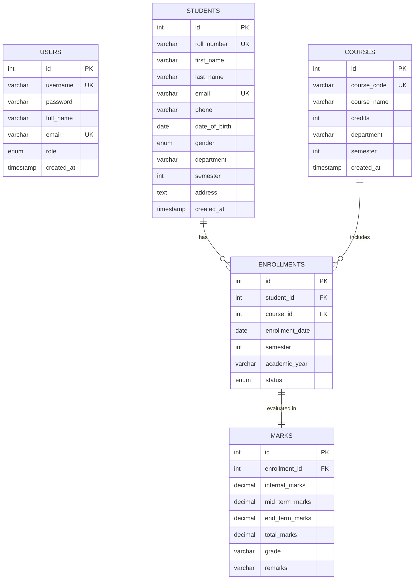
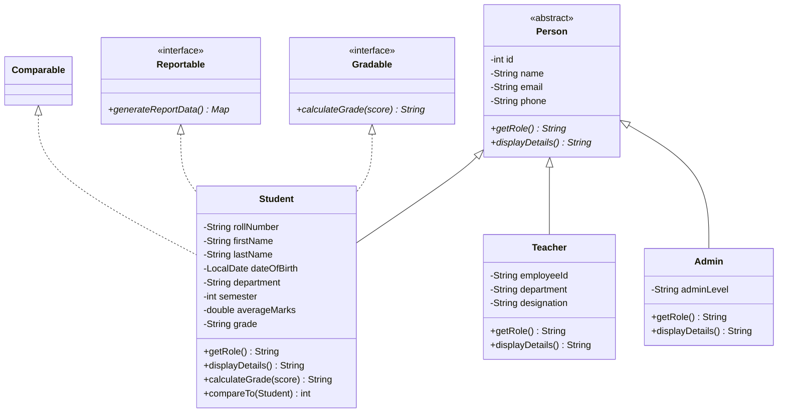

# EduCore Student Management System (SMS)

> **Enterprise College Student Management & Academic Grading Web Application**  
> Built with **Java 17**, **Jakarta Servlets 6.0**, **JSP (JSTL 3.0)**, **Plain JDBC**, and **MySQL 8.0**.  
> Engineered strictly according to academic evaluation rubrics with zero full-stack frameworks (no Spring, no Hibernate, no JPA, no Tailwind/Bootstrap CSS).

---

## 1. Problem Statement & Objectives

### Problem Statement
Traditional academic institutions struggle with fragmented, manual records across student admissions, course registrations, and evaluation grading. Paper ledgers and disconnected spreadsheets suffer from concurrency race conditions, data inconsistencies, security vulnerabilities (such as plaintext credentials and SQL injection risks), and lack real-time institutional analytics.

### Solution & Objectives
EduCore SMS delivers a unified, high-performance, web-based management portal that:
- Centralizes **Student Directory**, **Course Catalog**, **Course Enrollments**, and **Marks Evaluation**.
- Enforces strict **Role-Based Access Control (RBAC)** distinguishing Institutional Administrators from Academic Faculty.
- Implements resilient **ACID transactions** and **thread-safe sequence generation** under high concurrent load.
- Provides executive analytics (Top performers, course enrollments, grade distributions, database views).

---

## 2. User Roles & Permissions

| Role | Access Level | Permissions | Default Credentials |
| :--- | :--- | :--- | :--- |
| **ADMIN** | Full System Access | Student CRUD, Course CRUD, Course Enrollments, Marks Evaluation, Full Analytics, User Management | `admin` / `admin123` |
| **TEACHER** | Academic Evaluator | Student Directory View, Student Profile View, Course Enrollments, Enter & Edit Marks, View Analytics | `prof_sharma` / `admin123` |

---

## 3. System Architecture & Layered Design

The application adheres to a clean 6-tier Layered Architecture:

```
[ Browser / Client ] 
        │ (HTTP Requests: HTML5 / CSS3 / Vanilla JS)
        ▼
[ Web Filter Layer ] ── AuthFilter (Session Validation, URL Protection, RBAC)
        │
        ▼
[ Controller Layer ] ── Jakarta Servlets (@WebServlet: Login, Dashboard, Student, Course, Enrollment, Marks, Reports)
        │
        ▼
[ Service Layer ]    ── Business Logic, Server-Side Validations, ReentrantLock, Thread Pool Async Tasks
        │
        ▼
[ DAO Layer ]        ── Interfaces & Implementations (StudentDAOImpl, CourseDAOImpl, etc.)
        │ (Plain JDBC: PreparedStatement, Transactions, Batch Inserts, ResultSet Mapping)
        ▼
[ Database Layer ]   ── MySQL 8.0 (student_db: Tables, Constraints, Indexes, Views)
```

---

## 4. Entity-Relationship (ER) Diagram



---

## 5. Domain Class Diagram (OOP Implementation)



---

## 6. Project Directory Structure

```
Student Management System Java Project/
├── pom.xml                                 # Maven build configuration (WAR packaging, Tomcat embed, MySQL, JSTL, JUnit)
├── schema.sql                              # Complete MySQL database creation, tables, constraints, view, & sample data
├── run.bat                                 # Standalone Windows launcher script
├── RUBRIC_MAPPING.md                       # Comprehensive rubric-to-code compliance mapping
├── VIVA_QA.md                              # 25 likely viva questions and answers
├── README.md                               # Project documentation & execution guide
├── src/
│   ├── main/
│   │   ├── java/com/sms/
│   │   │   ├── dao/                        # DAO interfaces (StudentDAO, CourseDAO, etc.)
│   │   │   │   └── impl/                   # JDBC implementations (StudentDAOImpl, etc.)
│   │   │   ├── exception/                  # Custom exceptions (DuplicateEmailException, etc.)
│   │   │   ├── filter/                     # AuthFilter (Session & RBAC security)
│   │   │   ├── listener/                   # AppContextListener, SessionListener (AtomicInteger)
│   │   │   ├── model/                      # Person, Student, Teacher, Admin, User, Course, etc.
│   │   │   ├── service/                    # Business services (StudentService, AuthService, etc.)
│   │   │   ├── servlet/                    # Jakarta controllers (@WebServlet)
│   │   │   └── util/                       # DBConnection, ThreadPoolManager, CollectionsUtil, etc.
│   │   ├── resources/
│   │   │   └── db.properties               # MySQL database connection properties
│   │   └── webapp/
│   │       ├── css/style.css               # Vanilla CSS3 modern SaaS stylesheet
│   │       ├── js/main.js                  # Vanilla JavaScript interactions
│   │       ├── index.jsp                   # Context root redirect
│   │       └── WEB-INF/
│   │           ├── web.xml                 # Deployment descriptor (session timeout, custom error pages)
│   │           └── views/                  # Protected JSP views (JSTL/EL only)
│   │               ├── includes/           # Shared fragments (header.jsp, sidebar.jsp, footer.jsp)
│   │               ├── dashboard.jsp       # Analytics dashboard with CSS bar charts
│   │               ├── student-list.jsp    # Students directory with pagination & search
│   │               ├── student-form.jsp    # Responsive student add/edit form
│   │               ├── student-view.jsp    # Full student profile & grade sheet
│   │               ├── course-list.jsp     # Course catalog
│   │               ├── course-form.jsp     # Course creation & edit
│   │               ├── enrollment-list.jsp # Student-course bridge ledger
│   │               ├── enrollment-form.jsp # Course enrollment modal
│   │               ├── marks-list.jsp      # Academic marks ledger
│   │               ├── marks-form.jsp      # Assessment evaluation entry with auto-grade
│   │               ├── reports.jsp         # Multi-tab analytics (toppers, view reports, TreeMap rank)
│   │               ├── error-404.jsp       # Styled 404 page
│   │               └── error-500.jsp       # Styled 500 error page
│   └── test/java/com/sms/service/          # JUnit 5 unit test suites
```

---

## 7. Step-by-Step Installation & Execution Guide

### Prerequisites
1. **Java Development Kit (JDK 17 or higher)** installed (`java -version`).
2. **Apache Maven 3.9+** installed (`mvn -version`).
3. **MySQL Server 8.0+** running locally on port `3306`.

---

### Step 1: Create Database & Execute Schema
Open terminal or MySQL Workbench, and execute `schema.sql`:
```bash
mysql -u root -p < schema.sql
```
*Enter your MySQL root password when prompted.* This creates `student_db`, tables (`users`, `students`, `courses`, `enrollments`, `marks`), view `v_student_results`, and populates 12 sample students, 6 courses, 16 enrollments, and initial marks.

---

### Step 2: Configure Database Credentials
Edit `src/main/resources/db.properties` to match your local MySQL configuration:
```properties
db.url=jdbc:mysql://localhost:3306/student_db?useSSL=false&serverTimezone=Asia/Kolkata&allowPublicKeyRetrieval=true
db.username=root
db.password=YOUR_MYSQL_PASSWORD
db.driver=com.mysql.cj.jdbc.Driver
```

---

### Step 3: Run Standalone Console JDBC & OOP Demo
To verify plain JDBC CRUD operations and OOP Polymorphism without starting the web server:
```bash
mvn compile exec:java -Dexec.mainClass="com.sms.util.JdbcDemo"
```

---

### Step 4: Run Automated JUnit 5 Unit Tests
```bash
mvn test
```
*Runs all 11 unit tests for AuthService and StudentService.*

---

### Step 5: Run the Web Application

#### Option A: Instant One-Click Embedded Tomcat Launcher (Recommended)
Simply double-click `run.bat` or run:
```bash
mvn compile exec:java -Dexec.mainClass="com.sms.util.EmbeddedTomcatServer"
```
The server will boot on port `8080`.

#### Option B: Deploy Standard WAR to Standalone Apache Tomcat 10.1+
1. Build the production WAR bundle:
   ```bash
   mvn clean package
   ```
2. Copy `target/StudentManagementSystem.war` into your Tomcat installation directory:
   ```bash
   copy target\StudentManagementSystem.war "C:\path\to\apache-tomcat-10.1.x\webapps\"
   ```
3. Start Tomcat using `bin/startup.bat`.

---

### Step 6: Access the Application
Open your browser and navigate to:
```
http://localhost:8080/StudentManagementSystem/
```

**Login Credentials:**
- **Admin Role:** Username: `admin` | Password: `admin123`
- **Teacher Role:** Username: `prof_sharma` | Password: `admin123`

---

## 8. Screenshot Placeholders

| View | Description |
| :--- | :--- |
| **Login Screen** | *Full-screen glassmorphism card with gradient backdrop and show/hide password toggle.* |
| **Admin Dashboard** | *4 hover-lift stat cards, CSS-only course enrollment bar chart, live active users indicator.* |
| **Students Directory** | *Searchable, sortable, paginated student table with avatar pills and action buttons.* |
| **Student Profile** | *Detailed academic dossier showing personal data, enrolled subjects, and grade badges.* |
| **Marks Ledger** | *Interactive assessment form with real-time score summation and automatic letter grade calculation.* |
| **Reports Portal** | *Multi-tab analytics showing course toppers (SQL subquery), database view data, and TreeMap rank lists.* |

---

## 9. Limitations & Future Scope

### Current Limitations
- External email delivery is simulated asynchronously via `ThreadPoolManager` (logs to console/logger rather than sending real SMTP packets).
- Student attendance tracking is not yet integrated into the grading equation.

### Future Scope
- Integration with live payment gateways for semester tuition fee collection.
- Automated PDF report card generation using OpenPDF or iText.
- Student self-service portal allowing students to log in and inspect their semester transcripts.
